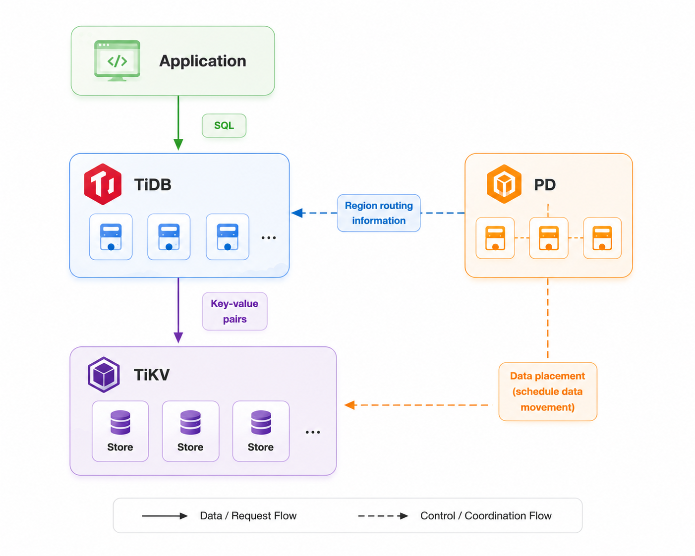
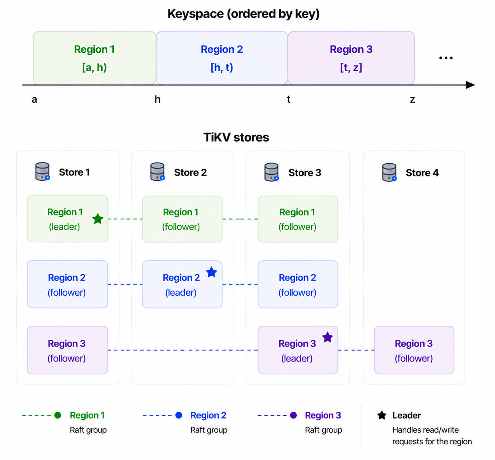

# TiKV 201: The TiDB Ecosystem

A basic TiDB cluster has three main components: **TiDB**, **TiKV**, and **PD (Placement Driver)**.



- **TiDB** is the compute layer. It accepts SQL requests from applications, processes queries, and translates them into key-value requests sent to TiKV.
- **TiKV** is the storage layer that stores key-value pairs.
- **PD** manages cluster metadata and coordinates data placement. It decides where data should be stored and schedules data movement between TiKV nodes.

TiKV runs as a cluster of nodes. Each node is a separate process called a **store**, typically running on a different machine or container.

## Regions

To split data among stores, TiKV divides the entire keyspace into smaller ranges. Each range is called a **Region**.

A Region is identified by a start key and an end key. It contains all keys within that range.

For example:

```text
Region 1: [a, h)
Region 2: [h, t)
Region 3: [t, z)
```

A key belongs to exactly one Region based on its range:

```text
cart:1           -> Region 1
order:9001       -> Region 2
user:42:name     -> Region 3
```

A Region is the basic unit TiKV uses to distribute and manage data. PD can guide Regions to move between stores to keep the cluster balanced. A Region typically contains less than 256 MiB of data. When a Region grows too large, TiKV can split it into smaller Regions; when neighboring Regions become small, TiKV can merge them into one Region.

## Replicas

A Region can have multiple copies stored on different TiKV stores. Each copy is called a **replica**.

A Region's replicas are managed by **Raft**. Among these replicas, one is elected as the **leader**. The leader handles read and write requests for the Region, while other replicas follow the leader and replicate its data.

For example:


If one TiKV store fails, other replicas of the same Region still exist on other stores.

## Routing and PD

TiDB uses **Region routing information maintained by PD** to locate the leader replica.

```text
key
 |
 v
Region
 |
 v
leader replica
 |
 v
TiKV store
```

PD maintains the **cluster-wide view**: where Regions are located, where their replicas are placed, and which store hosts each leader.

PD also keeps the cluster data balanced. It can schedule Regions between stores to balance data distribution and transfer leaders away from unhealthy stores.

In the TiDB ecosystem, PD also provides the timestamp used to establish transaction ordering for TiKV data. We will cover this later in the transaction sections.

With this picture, TiDB handles SQL, TiKV stores data through Regions and Raft groups, and PD manages cluster metadata and scheduling.
