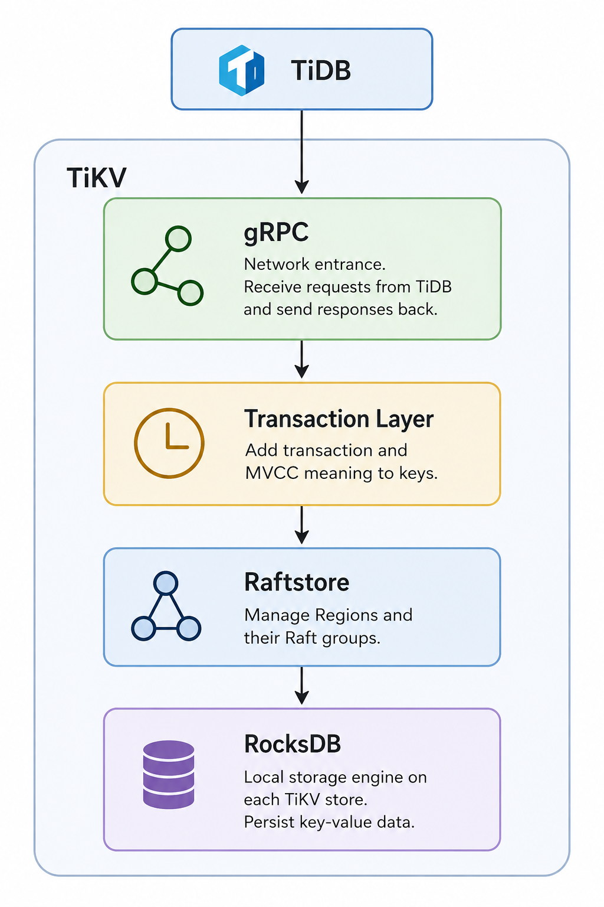

# TiKV 301: TiKV Architecture

In this chapter, we take a first look inside TiKV. TiKV is made up of a few major components.

At this level, it is enough to get familiar with the names. Some words may not be fully clear yet. We will revisit these concepts again in later chapters.

Starting from the bottom, **RocksDB** is an open-source, single-machine key-value store. It is the KV engine TiKV uses to persist data on each store.

On top of RocksDB, **Raftstore** makes TiKV a distributed key-value store across multiple nodes. It does this through the **Raft consensus protocol**. Raftstore manages the Raft replication of different Regions, their lifecycle, and their movement across stores.

This is where a large part of TiKV's management work lives. It is also where much of the code complexity begins. We will approach it bit by bit.

Above Raftstore, the **transaction layer** gives TiKV transaction semantics. One core idea here is **MVCC**: TiKV adds versioned meaning to user keys so reads and writes can follow transaction rules. We will cover this in 404.

At the top, **gRPC** makes TiKV a server. It is an open-source RPC library that lets TiKV receive requests from clients such as TiDB and send responses back.

For now, keep the map: gRPC receives requests, the transaction layer adds transaction semantics, Raftstore manages distributed Regions through Raft, and RocksDB stores local key-value data.
