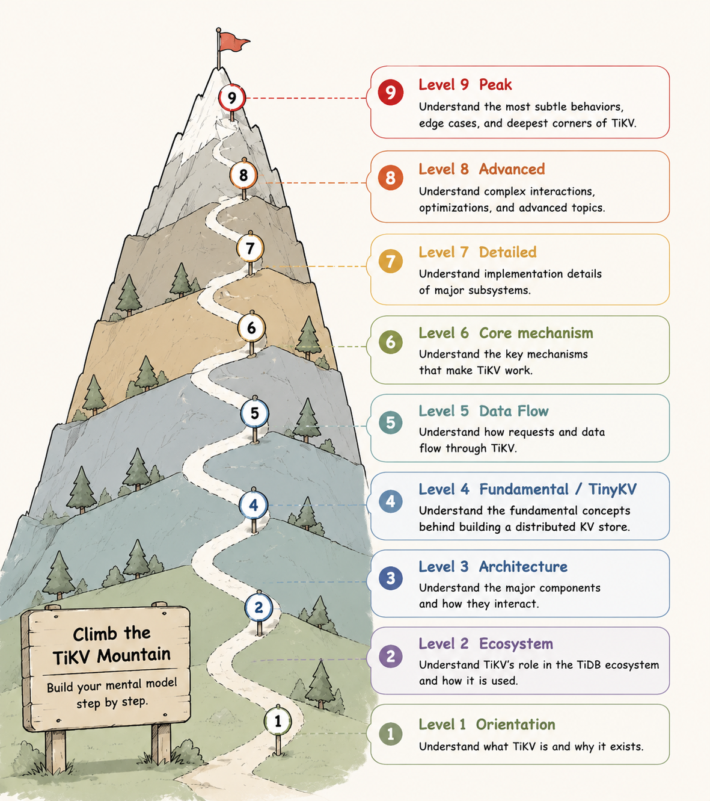

# Level Map

| Level | Topics |
|---|---|
| Level 1 (Orientation) | TiKV<a href="101.html">101 What Is TiKV?</a> |
| Level 2 (Ecosystem) | TiKV<a href="201.html">201 TiDB Ecosystem</a> |
| Level 3 (Architecture) | TiKV<a href="301.html">301 Architecture</a> |
| Level 4 (Fundamental) | RAFT<a href="401.html">401 Raft Crash Course</a>RAFTSTORE<a href="402.html">402 Raft Event Loop</a>ROCKSDB<a href="403.html">403 RocksDB Intro</a>TXN<a href="404/index.html">404 Transaction Intro</a> |
| Level 5 (Data Flow) | RAFTSTORE<a href="501.html">501 Write Flow</a> <a href="502.html">502 Linearizable Reads</a>COP<a href="503.html">503 Coprocessor Intro</a> |
| Level 6 (Core Mechanism) | RAFT<a href="601.html">601 Leader Transfer</a> <a href="602.html">602 Replica Movement</a> <a href="603.html">603 Raft Snapshot</a>RAFTSTORE<a href="604.html">604 Region Split</a>ROCKSDB<a href="605.html">605 RocksDB LSM Tree</a>COP<a href="606.html">606 Coprocessor Patterns</a>TXN<a href="607.html">607 Transaction Scheduler</a> |
| Level 7 (Detailed) | RAFTSTORE<a href="701.html">701 Batch System</a> <a href="702.html">702 Slow Score</a> <a href="703.html">703 Region Worker</a>ROCKSDB<a href="704.html">704 RocksDB Details</a> <a href="705.html">705 Titan</a>COP<a href="706.html">706 YATP Read Pool</a> <a href="707.html">707 Coprocessor Execution</a>TXN<a href="708.html">708 Async Commit and 1PC</a> |
| Level 8 (Advanced) | RAFTSTORE<a href="801.html">801 Region Merge</a> <a href="802.html">802 Raft Hibernation</a>TXN<a href="803.html">803 In-Memory Pessimistic Locks</a>ROCKSDB<a href="804.html">804 GC and Compaction Filter</a> |
| Level 9 (Peak) | RAFTSTORE<a href="901.html">901 Peer Lifecycle</a> |
