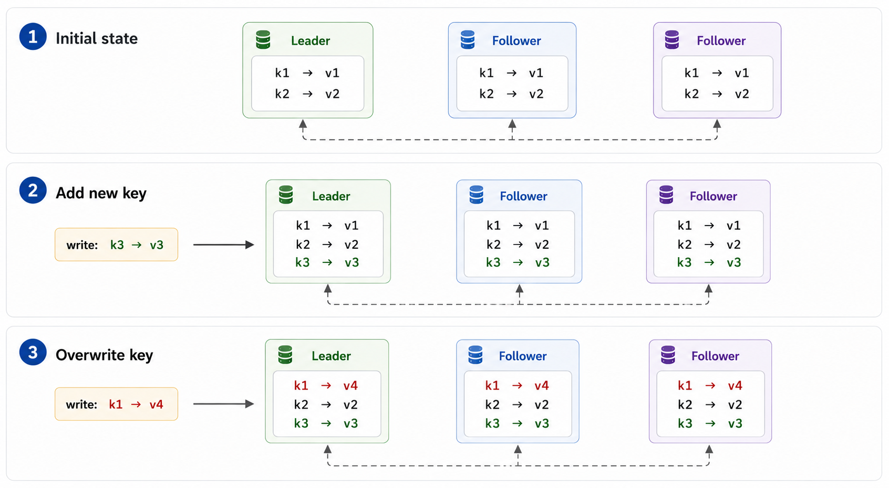
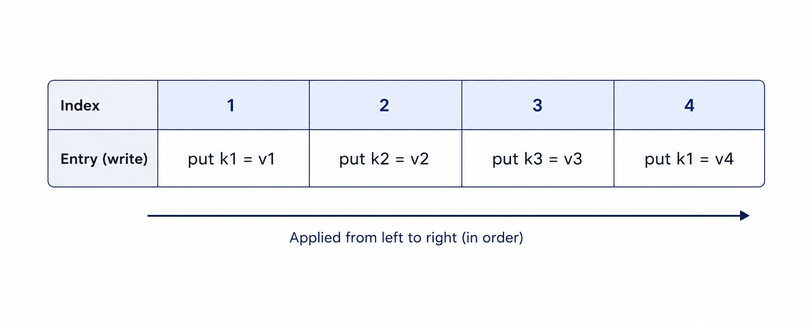
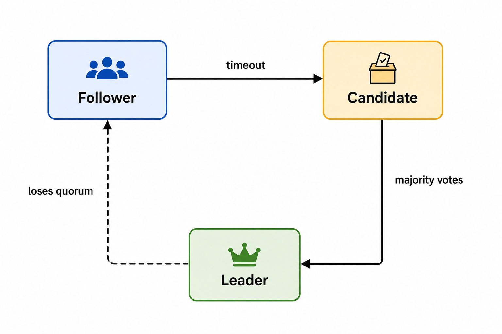

# TiKV 401: Raft Crash Course

Each Region has multiple replicas. The replicas are kept in sync through **Raft**.

How? Let's take a look.

First, each replica stores the data of a Region. At this level, think of the data as key-value pairs:



<p class="figure-title">Figure 1. Same writes, same state.</p>

The order of writes matters. If two writes touch the same key, different orders can produce different final states:

```text
Order A:
(1) k1 -> v4
(2) k1 -> v5
final: k1 -> v5

Order B:
(1) k1 -> v5
(2) k1 -> v4
final: k1 -> v4
```

The key is to make all replicas observe write events in the same order. This gives the replicas a **total ordering** of events. If every replica applies the same events in the same order, the final data state is the same.

Raft does this by maintaining a **log**. A log is an ordered list of entries. Each entry is an event, usually a write to be applied.



<p class="figure-title">Figure 2. Log entries, applied in order.</p>

If replicas keep the log in sync and apply it from left to right, they reach the same data state. This is the basic idea of using the log as the source of truth for data.

In the normal path, the log grows by appending new entries. Each entry has an index.

## Roles

For normal replication, there are two roles: **leader** and **follower**.

The **leader** accepts new write requests from external clients. It appends each write as a new log entry, then sends that entry to followers.

A **follower** does not accept new writes for the Region. It follows the leader's log. If a write request reaches a follower, the follower rejects it.

Typically, the leader sends Raft log entries to followers. Followers do not talk to each other. They receive entries from the leader.

The leader also sends periodic heartbeats to followers to signal that it is still alive.

Who should be the leader? It is chosen by election. The leader can change. Each election has a **term**. A term is a monotonically increasing number.

Each write is labeled with the leader's term before it is sent to followers. In the log, each entry is labeled with an index and a term.

```text
| index | 1           | 2           | 3           |
| term  | 7           | 7           | 8           |
| entry | put k3 = v3 | put k1 = v4 | put k1 = v5 |
```

## Leader Election

If a follower stops hearing heartbeats from the leader, it waits for an election timeout, becomes a **candidate**, increases the term, and asks other replicas to vote.



<p class="figure-title">Figure 3. Leader election state transitions.</p>

A candidate is a replica trying to become the next leader.

If the candidate gets votes from a majority of replicas, it becomes leader.

If no one wins, replicas wait for randomized timeouts and try again with a higher term. The random wait helps avoid everyone starting elections at the same time forever.

A replica votes only if the candidate's log is at least as up to date as its own log.

Up to date means:

- The candidate's last log entry has a higher term.
- Or the last log term is the same, and the candidate's last log index is at least as large.

```text
voter last log:     index 8, term 3

candidate A:        index 7, term 4   -> can be voted for
candidate B:        index 9, term 3   -> can be voted for
candidate C:        index 9, term 2   -> rejected
candidate D:        index 7, term 3   -> rejected
```

## Commit

A leader cannot apply a new write just because it has appended the entry locally. If it applied the entry immediately and then failed, that entry might be missing from the next leader.

The leader waits until the entry has been persisted by a majority of voting replicas. Then it can advance the **commit index**.

```text
3 voting replicas

leader:   [1] [2] [3]
follower: [1] [2] [3]
follower: [1] [2]

entry 3 is on a majority -> entry 3 can be committed
```

The commit index marks the highest log index known to be safe. Entries with index less than or equal to the commit index can be applied to the data state.

Committed means the entry is settled in the history of the log. It will not be removed by a future leader. If you want to undo its effect, you need another log entry.

It can be proven that once an entry is committed, it will not be lost as long as a majority of voting Raft peers survives. We will not go into the detailed proof here, but the idea is majority overlap. A future leader also needs votes from a majority. That majority overlaps with the majority that stored the committed entry. Since voters reject candidates whose logs are behind, the future leader must contain the committed entries.

A leader only advances the commit index after an entry from its own term has been replicated to a majority. Older entries can become committed together with that current-term entry.

## Learners

Raft can also have **learners**. A learner receives log entries from the leader and keeps its log up to date, but it does not vote.

Learners are useful when adding new replicas. The new replica can first catch up as a learner, without immediately changing the voting group that protects correctness.

## Raft APIs

Raft communicates through just a few message types. At this level, only two matter:

- **AppendEntries** - sent by the leader to replicate log entries and maintain leadership.
- **RequestVote** - sent by a candidate during an election to ask other replicas for their votes.

You do not need to know the message formats yet. Just remember their roles:

```text
Leader
   |
   | AppendEntries
   v
Followers

Candidate
   |
   | RequestVote
   v
Other replicas
```

Both messages are request-response RPCs.

For AppendEntries, a follower replies whether it accepted the new entries. If its log has diverged from the leader's, it rejects the request. The leader then backs up and retries with earlier entries until both logs share a common history. Once they do, the follower discards its conflicting entries and catches up to the leader.

For RequestVote, a replica simply replies whether it grants its vote to the candidate.

That's enough to understand the rest of Raft. Almost everything the protocol does is built on these two messages.

For TiKV, this is the first Raft model to keep in mind: one Region has multiple replicas, one replica leads, writes become ordered log entries, and committed entries survive leader changes as long as a majority of voting replicas survives.
